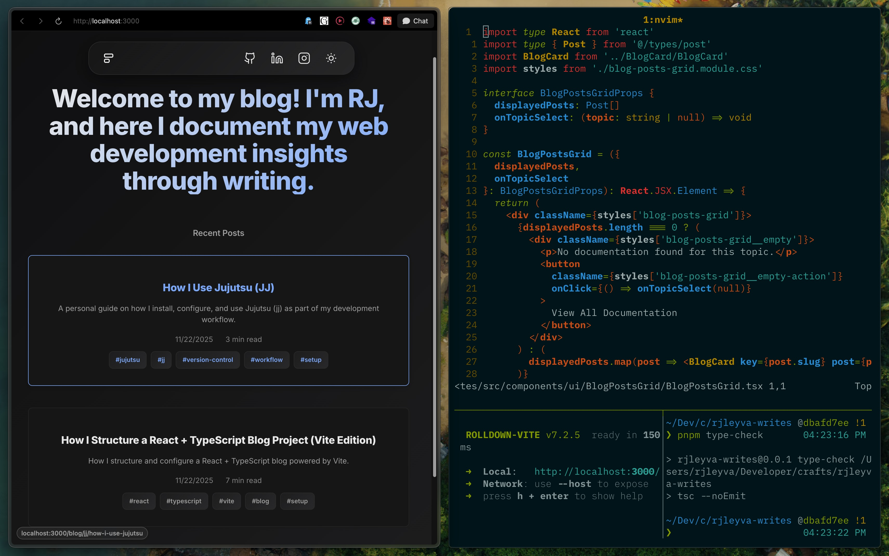

# rjleyva-writes

RJ Leyva's personal blog, documenting web development insights through writing.

---

## Current Status (WIP)

### Home Page

### Blog Page

### Sample Post

## Tech Stack

### Core Framework & Language

- React 19+
- TypeScript 5+
- Vite 7+

### Routing

- React Router v7 (data-mode)

### Styling

- Modern Normalize
- CSS Modules with BEM methodology
- CSS custom properties for theming

### Development Tools

- ESLint with React plugins
- Prettier with import sorting
- TypeScript for type checking

### Key Dependencies

- @vitejs/plugin-react
- eslint-plugin-react-refresh
- modern-normalize

## License

MIT License.

If you find this project helpful, please consider giving it a ⭐.
